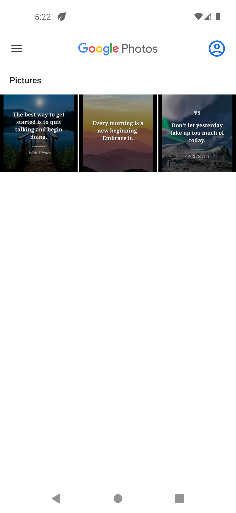

# Quotes App

A beautiful, inspirational Flutter application that displays motivational, morning, night, and faith-based quotes with background images. Users can save, share, or copy quotes, making it perfect for daily inspiration and sharing positivity.

---

## Features

- Browse a curated collection of inspirational quotes with beautiful background images
- Save quotes as images to your device gallery
- Share quotes as text with friends and family
- Copy quotes to clipboard for easy use
- Smooth swipe navigation between quotes
- Responsive and modern UI

---

## Screenshots

| Quotes | Saved Quotes |
|:---:|:---:|
| |  |
---

## Getting Started


### Installation
1. **Clone the repository:**
   ```bash
   git clone <your-repo-url>
   cd quotes_app
   ```
2. **Install dependencies:**
   ```bash
   flutter pub get
   ```
3. **Run the app:**
   ```bash
   flutter run
   ```

---

## Usage

- **Swipe** left/right to browse quotes
- **Save**: Tap the save button to save the current quote as an image
- **Share**: Tap the share button to share the quote as text
- **Copy**: Tap the copy button to copy the quote text to clipboard

---

## Project Structure

```
lib/
  main.dart                # App entry point
  provider/
    quotes_provider.dart   # State management for quotes
  screens/
    home_screen.dart       # Main UI screen
  widgets/
    quote_card.dart        # Quote display widget
  utils/
    utils.dart             # Utility functions (share, save, copy)
assets/
  quotes.json              # Local quotes data
```

---

## Dependencies

- [provider](https://pub.dev/packages/provider) - State management
- [share_plus](https://pub.dev/packages/share_plus) - Sharing quotes
- [image_gallery_saver](https://pub.dev/packages/image_gallery_saver) - Save images to gallery
- [permission_handler](https://pub.dev/packages/permission_handler) - Handle storage permissions
- [cupertino_icons](https://pub.dev/packages/cupertino_icons) - iOS style icons